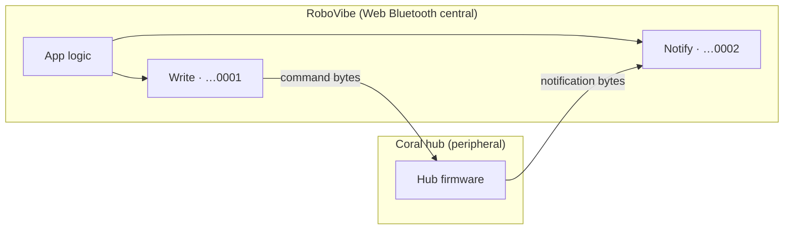
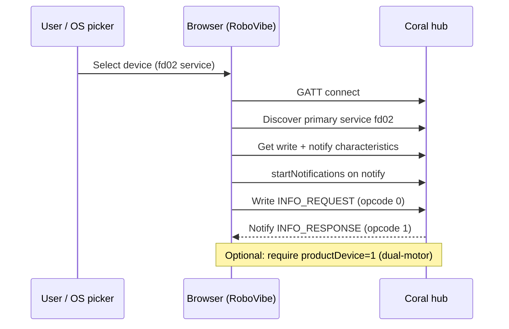
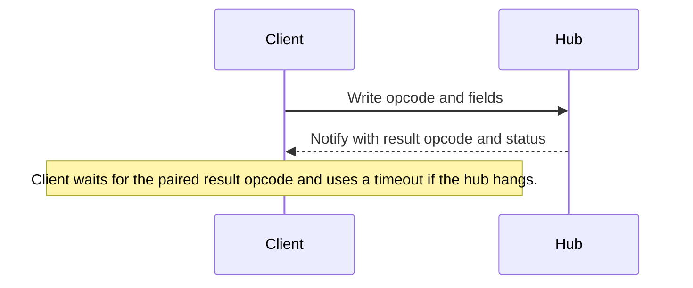
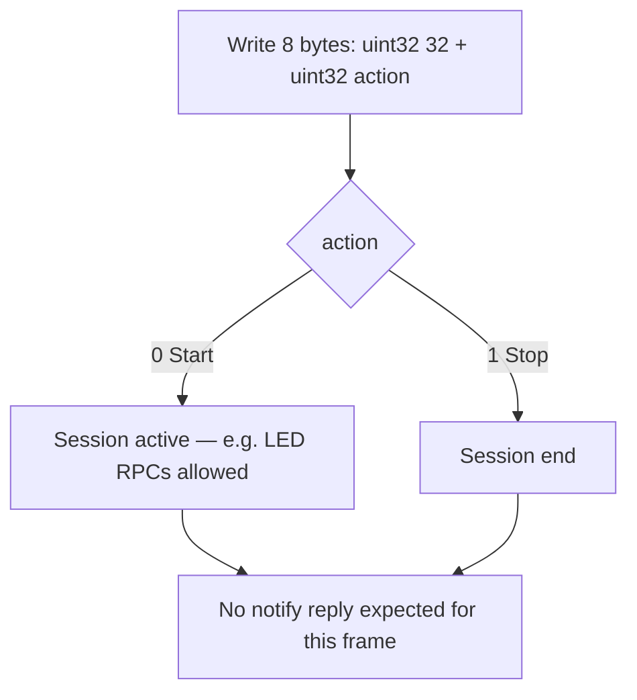
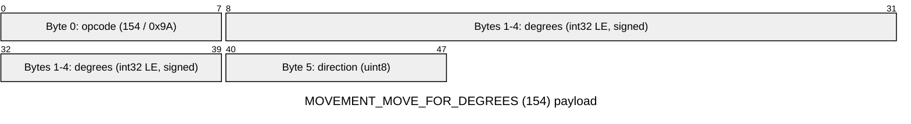
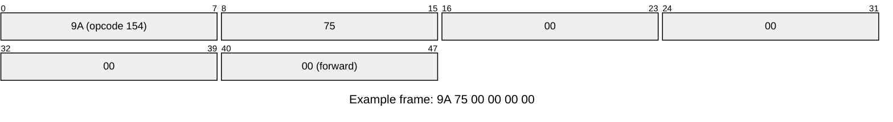
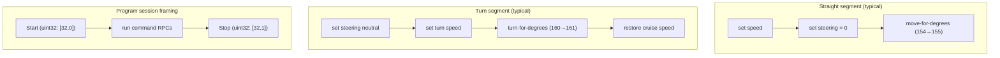

# LEGO CS&AI Coral — Bluetooth GATT protocol (connected)

This document describes the **Bluetooth Low Energy GATT protocol** used with a **CS&AI Coral-class hub** (typically **dual-motor**) after a **BLE connection** is established. Message type IDs follow the same numeric scheme as LEGO **Coding Canvas** / SPIKE-application **movement, light, and sound** commands. **Advertisement** payloads (broadcast service data, NFC) are **not** covered here; this spec is **GATT write/notify only**. It is also **not** the Powered Up **Port Value Single** `0x45` protocol.

For **fd02 advertisement** layout (sticks / colour sensor, 12-byte service data), see [CORAL_FD02_BLE_ADVERTISEMENT.md](CORAL_FD02_BLE_ADVERTISEMENT.md).

---

## Diagrams — GATT roles and messaging

### Central ↔ peripheral

RoboVibe runs as a **GATT central** (browser Web Bluetooth): one BLE connection per chosen hub.

### Connection and bootstrap

### RPC command pattern (most opcodes)

### Program-flow bracket (opcode 32, fire-and-forget)

---

## RoboVibe — where this protocol is used

**App URL:** [https://robovibe.afarago.hu](https://robovibe.afarago.hu) — Web Bluetooth needs a **secure context** (HTTPS) and OS permission for Bluetooth where applicable.

**Routes (Coral GATT — this document)**

| Feature                       | Path                                                             | What you get                                                                                                                                                         |
| ----------------------------- | ---------------------------------------------------------------- | -------------------------------------------------------------------------------------------------------------------------------------------------------------------- |
| **AI / ML lab + Send to Hub** | [https://robovibe.afarago.hu/ai](https://robovibe.afarago.hu/ai) (aliases `/aiml`, `/ml`) | Pick **LEGO CS&AI Coral** from the unified BLE flow; motor / light / beep presets map to these RPCs. **Send to Hub** toggles live commands when a model is selected. |
| **Main session (map / code)** | [https://robovibe.afarago.hu](https://robovibe.afarago.hu/)                              | **Hub controls** connect Coral for program run / Blockly-style execution on a dual-motor Coral hub over the same `fd02` GATT service.                            |

**Related (not GATT — advertisements only):** BLE **service data** for `fd02` (scan / sticks / sensor colour) is documented in [CORAL_FD02_BLE_ADVERTISEMENT.md](CORAL_FD02_BLE_ADVERTISEMENT.md) and can be inspected in the app at [/coral](https://robovibe.afarago.hu/coral).

---

## GATT surface

Fixed **128-bit** UUIDs (`...-00805f9b34fb` base UUID):

| Role                                 | UUID (abbreviated prefix)                  |
| ------------------------------------ | ------------------------------------------ |
| **Primary service**                  | `0000fd02-0000-1000-8000-00805f9b34fb` |
| **Write / command characteristic**   | `0000fd02-0001-1000-8000-00805f9b34fb` |
| **Notify / response characteristic** | `0000fd02-0002-1000-8000-00805f9b34fb` |

Typical connection sequence:

1. Discover and select a device that exposes the **fd02** service (OS-specific APIs vary).
2. Connect GATT and open the **primary service** above.
3. Obtain the **write** (`…0001`) and **notify** (`…0002`) characteristics.
4. Subscribe to notifications on the notify characteristic (e.g. `startNotifications()` + **value changed** handler).
5. **Bootstrap:** send `INFO_REQUEST` (`0`) and parse `INFO_RESPONSE` (`1`) to read product metadata (**Field layouts — INFO_RESPONSE** below).

Teardown should stop notifications, remove listeners, and disconnect. An implementation may restrict pairing to hubs whose `INFO_RESPONSE` identifies a **dual-motor** Coral product.

Writes may use **write-without-response** when the characteristic supports it; otherwise **write-with-response**.

---

## Transport model: RPC vs fire-and-forget

### A. Request → notify (RPC)

Most commands are `[opcode_byte, …fields…]` on the write characteristic. The hub answers on **notify** with a **result** message whose first byte is typically **the result opcode** paired with the command (often `command + 1` for the families below). Match replies by **the first byte of the notification payload** (message / message-type id).

The client should wait for the **expected result id** (or apply a **timeout**). Long movement commands may need **longer timeouts** than short RPCs.

**Success rule:** After the result opcode, a **wired command status** is present: `0` means success. If the payload has **at least 3 bytes**, status is usually `payload[2]`; if only **2 bytes**, use `payload[1]`. Non-zero status indicates failure (e.g. `2` has been observed for invalid light-colour requests).

### B. Fire-and-forget (program flow)

**Program flow** uses **eight bytes**: two little-endian `uint32` values `[32, programAction]` — first word is message type `32`, second is `Start = 0` or `Stop = 1`. No reply is expected on notify for this frame. It is used to bracket a **program session** on the hub (e.g. **Start** before **light** RPCs that require an active session, then **Stop**).

---

## Message type IDs (Opcodes)

| ID      | Direction | Meaning                                                                       |
| ------- | --------- | ----------------------------------------------------------------------------- |
| **0**   | → hub     | `INFO_REQUEST` — no trailing fields                                       |
| **1**   | ← hub     | `INFO_RESPONSE` — product metadata                                        |
| **110** | → hub     | `LIGHT_COLOR_COMMAND`                                                     |
| **111** | ← hub     | `LIGHT_COLOR_RESULT`                                                      |
| **112** | → hub     | `PLAY_BEEP_COMMAND`                                                       |
| **113** | ← hub     | `PLAY_BEEP_RESULT`                                                        |
| **114** | → hub     | `STOP_SOUND_COMMAND`                                                      |
| **115** | ← hub     | `STOP_SOUND_RESULT`                                                       |
| **150** | → hub     | `MOVEMENT_MOVE_COMMAND` — `uint8` direction (**continuous** drive)    |
| **151** | ← hub     | `MOVEMENT_MOVE_RESULT`                                                    |
| **154** | → hub     | `MOVEMENT_MOVE_FOR_DEGREES_COMMAND`                                       |
| **155** | ← hub     | `MOVEMENT_MOVE_FOR_DEGREES_RESULT`                                        |
| **160** | → hub     | `MOVEMENT_TURN_FOR_DEGREES_COMMAND`                                       |
| **161** | ← hub     | `MOVEMENT_TURN_FOR_DEGREES_RESULT`                                        |
| **168** | → hub     | `MOVEMENT_STOP_COMMAND`                                                   |
| **169** | ← hub     | `MOVEMENT_STOP_RESULT`                                                    |
| **170** | → hub     | `MOVEMENT_SET_SPEED_COMMAND` — speed **−100…+100** (see below)            |
| **171** | ← hub     | `MOVEMENT_SET_SPEED_RESULT`                                               |
| **172** | → hub     | `MOVEMENT_SET_END_STATE_COMMAND`                                          |
| **173** | ← hub     | `MOVEMENT_SET_END_STATE_RESULT`                                           |
| **174** | → hub     | `MOVEMENT_SET_ACCELERATION_COMMAND`                                       |
| **175** | ← hub     | `MOVEMENT_SET_ACCELERATION_RESULT`                                        |
| **176** | → hub     | `MOVEMENT_SET_TURN_STEERING_COMMAND` — steering / turn rate **−100…+100** |
| **177** | ← hub     | `MOVEMENT_SET_TURN_STEERING_RESULT`                                       |

**Program flow auxiliary** (UInt32 framing, **not** the single-byte opcode style): `32` = **program flow notification** (**Start** `0` / **Stop** `1`).

---

## Field layouts (writes)

**Default endianness:** little-endian.

### `INFO_RESPONSE` (`1`) — hub parsing

Requires **≥ 17 bytes** and `payload[0] = 1`. `productGroupDevice` is `uint16` at byte offset **15** (LE):

- `productDevice = u16 & 0xFF` — value `1` conventionally denotes a **double-motor** Coral-class device.
- `productGroup = (u16 >> 8) & 0xFF`.

Other `productDevice` values can be labelled generically by group and device id.

### Movement directions

`MovementMoveDirection` (movement / move-for-degrees):

| Direction | Value |
| --------- | ----- |
| Forward   | **0** |
| Backward  | **1** |
| Left      | **2** |
| Right     | **3** |

### `MOVEMENT_MOVE_FOR_DEGREES` (`154` → `155`) — write payload layout
Write body **6 bytes**: opcode **154**, **signed** motor rotation **degrees** as `int32 LE`, then **direction** `uint8`.

| Byte index | Size  | Field           | Details                                                                                                                                                                                                                                              |
| ---------- | ----- | --------------- | ---------------------------------------------------------------------------------------------------------------------------------------------------------------------------------------------------------------------------------------------------- |
| **0**      | **1** | `opcode`    | `154` (`0x9A`)                                                                                                                                                                                                                                   |
| **1–4**    | **4** | `degrees`   | **Signed** `int32`, little-endian. Interpreted as **motor rotation**, not linear millimeters on the wire. Distance-based programs often convert workspace units to degrees using wheel geometry and app-specific calibration before sending **154**. |
| **5**      | **1** | `direction` | `MovementMoveDirection`: **0** forward, **1** backward, **2** left, **3** right.                                                                                                                                                                 |

Packed view: bytes **1–4** together form **signed int32 LE degrees**.

**Example:** **117°** forward → `117` (`0x00000075` LE):

Packed decode: `9A | 75 00 00 00 | 00` = opcode **154**, degrees **117**, direction **forward**.

**Notify `155`:** first byte `155`. Status at `payload[1]` or `payload[2]` (`0` = success).

`MOVEMENT_TURN_FOR_DEGREES` (`160` → `161`): Same **6-byte** layout with opcode `160` instead of `154`.

### `MOVEMENT_MOVE_COMMAND` (`150` → `151`) — continuous drive
Same role as Coding Canvas **start-direction** behaviour: one **direction** byte biases **both** motors; motion continues until `MOVEMENT_STOP` (`168`), another `150` with a new direction, or until a **finite** move (`154` / `160`) replaces hub behaviour (exact interaction depends on firmware — treat `150` as **start / hold continuous drive**).

| Byte index | Size  | Field           | Details                                                                                             |
| ---------- | ----- | --------------- | --------------------------------------------------------------------------------------------------- |
| **0**      | **1** | `opcode`    | `150` (`0x96`)                                                                                  |
| **1**      | **1** | `direction` | `MovementMoveDirection` `uint8`: **0** forward · **1** backward · **2** left · **3** right. |

**Layout:** `[ opcode | dir ]` — **2 bytes**.

**Example — forward:** `96 00`.

**Notify `151`:** first byte `151`; status at `payload[1]` or `payload[2]` (`0` = success).

This differs from `154`, which executes a **finite** rotation in degrees.

---

### `MOVEMENT_SET_SPEED_COMMAND` (`170` → `171`)
Sets **straight-line drive speed** as a **signed percentage** in the Coding Canvas `setSpeed` sense.

| Byte index | Size  | Field              | Details                                                                                                                                                                                                                                                                                  |
| ---------- | ----- | ------------------ | ---------------------------------------------------------------------------------------------------------------------------------------------------------------------------------------------------------------------------------------------------------------------------------------- |
| **0**      | **1** | `opcode`       | `170` (`0xAA`)                                                                                                                                                                                                                                                                       |
| **1**      | **1** | `speedPercent` | **Logical range −100…+100.** Encode as a single byte: **round** to integer, **clamp** to **[−100, +100]**, then if negative emit `256 + value` (two’s-complement style in one byte); if non-negative emit the value as `0…100`. Smallest non-zero step is **±1** after rounding. |

**Examples**

| Meaning   | Byte 1 (decimal)                       | Byte 1 (hex) | Full write (hex) |
| --------- | -------------------------------------- | ------------ | ---------------- |
| **+41%**  | `41`                               | `29`     | `aa 29`      |
| **+100%** | `100`                              | `64`     | `aa 64`      |
| **−100%** | `156` (unsigned view: **256−100**) | `9c`     | `aa 9c`      |
| `0%`  | `0`                                | `00`     | `aa 00`      |

**Notify `171`:** status at `payload[1]` or `payload[2]`, same rule as other RPC results.

**Sign:** **Positive** = forward drive strength for straights; **negative** = reverse. `150` still selects **geometric** direction; `170` sets **how fast** the hub attempts to run.

---

### `MOVEMENT_SET_TURN_STEERING_COMMAND` (`176` → `177`)
Differential steering / **turn rate** in the Coding Canvas `setturnrate` sense. Wire range **−100…+100** using the **same single-byte encoding as speed** (not the full **−128…127** range used for some other commands such as **light color**).

| Byte index | Size  | Field          | Details                                                                                      |
| ---------- | ----- | -------------- | -------------------------------------------------------------------------------------------- |
| **0**      | **1** | `opcode`   | `176` (`0xB0`)                                                                           |
| **1**      | **1** | `steering` | **−100…+100** with the speed-style byte encoding. `0` = straight / no differential bias. |

**Examples**

| Meaning                     | Hex write                                      |
| --------------------------- | ---------------------------------------------- |
| **Centre steering**         | `b0 00`                                    |
| **+10** (mild right bias)   | `b0 0a`                                    |
| **−100** (strong left bias) | `b0 9c` (same low byte as **−100%** speed) |

**Notify `177`:** status (`0` = success) at `payload[1]` or `payload[2]`.

**Relationship:** `176` adjusts **left vs right** motor balance; `150`, `154`, and `160` still start or bound motion. A non-zero `176` combined with **forward** `154` is one way to approximate **arc** motion.

### Light (`110`)

After opcode: **color** as **signed 8-bit** value (**−1** may mean “none” in some stacks), **pattern** `uint8`, **intensity** `uint8` (`0…255`). Aligns with Coding Canvas **light color** command layout.

### Beep (`112`)

Write body (**5 bytes**): `[112, soundPattern_uint8, frequency_lo, frequency_hi, repetitions]` with `frequency` as `uint16 LE`. **Single-shot** pattern uses wire `0` for **soundPattern**.

**Example A — single** pattern, **880 Hz**, **0** repetitions:

| Byte | Hex         | Meaning                  |
| ---- | ----------- | ------------------------ |
| 0    | `70`    | Opcode **112**           |
| 1    | `00`    | Pattern **0** (single)   |
| 2–3  | `70 03` | **880** Hz LE (`0x0370`) |
| 4    | `00`    | Repetitions **0**        |

Full write: `70 00 70 03 00`.

**Example B:** pattern **0**, **1000** Hz (`e8 03` LE), **2** repetitions: `70 00 e8 03 02`.

Notify `113`: status uses the same rule as other RPC results.

### Stop sound (`114`)

No payload after opcode.

### End state (`172`)

**Signed 8-bit** end-state value (coast vs brake semantics depend on hub firmware).

### Acceleration (`174`)

Two `uint8` fields: **acceleration**, **deceleration**.

---

## Coding Canvas distance “steps” and motor degrees

In **Coding Canvas**, **move-by-distance** is often expressed in **steps**. Applications map steps to **motor degrees** for opcode `154` using a fixed ratio (commonly on the order of **~59°** of motor rotation per step, depending on calibration).

Typical mapping for a **forward/back** distance block:

1. Convert desired travel (e.g. millimeters) to a **fractional step count** using wheel diameter and app-specific scale.
2. `motorDegrees = round(|steps| × degreesPerStep)`, with a minimum of **1** degree when motion is non-zero.
3. Send `motorDegrees` as `int32 LE` in `154` with **forward** or **backward** **direction**.

So **logical steps** live in the block layer; **154** always carries **integer motor degrees**.

---

## Typical block-level ↔ wire mapping

Illustrative correspondence (names follow **Coding Canvas** / SPIKE-style blocks, not a particular source tree):

| Intended behaviour            | Wire (command → result)                                               |
| ----------------------------- | --------------------------------------------------------------------- |
| **Set drive speed (percent)** | `170` → `171`                                                     |
| **Set turn rate / steering**  | `176` → `177`                                                     |
| **Move straight by distance** | `154` → `155` (after step→degree conversion)                      |
| **Turn in place**             | `160` → `161`                                                     |
| **Arc** (composite)           | Often `176`, `170`, `160`, restore `170`, `176`→`0` |
| **Start continuous drive**    | `150` → `151`                                                     |
| **Stop wheels**               | `168` → `169`                                                     |
| **Beep**                      | `112` → `113`                                                     |
| **Silence**                   | `114` → `115`                                                     |
| **Hub LED**                   | `110` → `111`                                                     |
| **Coast / brake style**       | `172` → `173`                                                     |
| **Accel / decel limits**      | `174` → `175`                                                     |

A **straight** segment often sequences: **set speed** → **steering 0** → **move-for-degrees**. A **turn** segment often resets steering, sets turn speed, sends **160**, then restores cruise speed.

**Program session:** issuing `[32, 0]` then `uint32` **Start**, running commands, then `[32, 1]` **Stop** (each as **two** LE `uint32` values, **8 bytes** total) matches hubs that require an explicit **program flow** bracket for certain operations (e.g. LED).

---

## Lego CS&AI colour palette

Coding Canvas LegoColor indices `0 … 10` as `int8` on the wire.

| Index  | Name         |
| ------ | ------------ |
| **0**  | ⚫ Black      |
| **1**  | 🩷 Magenta   |
| **2**  | 🟣 Purple    |
| **3**  | 🔵 Blue      |
| **4**  | 🩵 Azure     |
| **5**  | 🟦 Turquoise |
| **6**  | 🟢 Green     |
| **7**  | 🟡 Yellow    |
| **8**  | 🟠 Orange    |
| **9**  | 🔴 Red       |
| **10** | ⚪ White      |

---

## Timeouts

Implementations commonly use **on the order of 8 seconds** for initial connection establishment. **Movement** RPCs that wait for `155` or `161` may need timeouts **scaled to expected motion duration** plus margin, or they may hang if the hub is slow or unresponsive.

---

## Notes

Opcodes align with **Coding Canvas** / SPIKE-application `MessageType`-style numbering used in classroom stacks. **Turn behaviour**, **program-flow bracketing**, and **status codes** vary with **hardware and firmware** and are not defined by a single public LEGO BLE PDF.