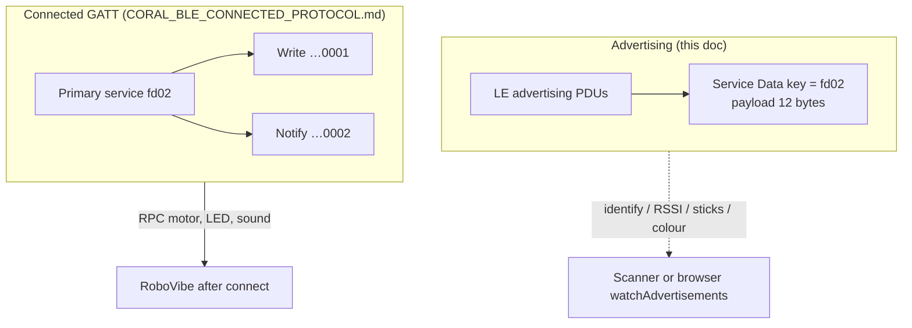
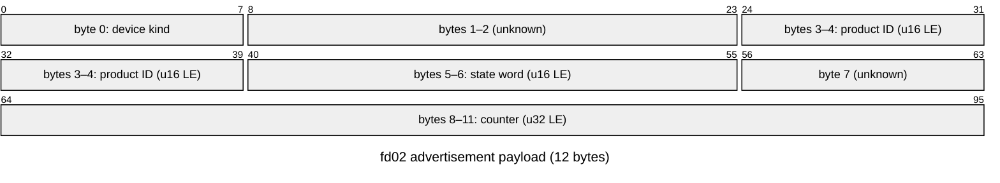
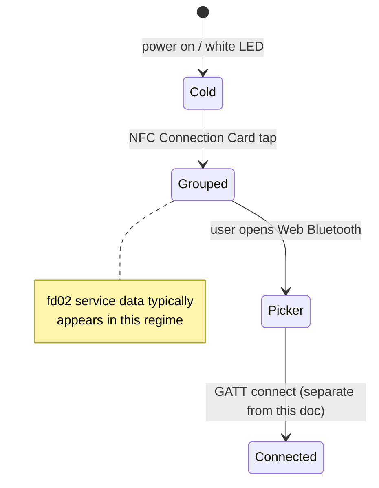
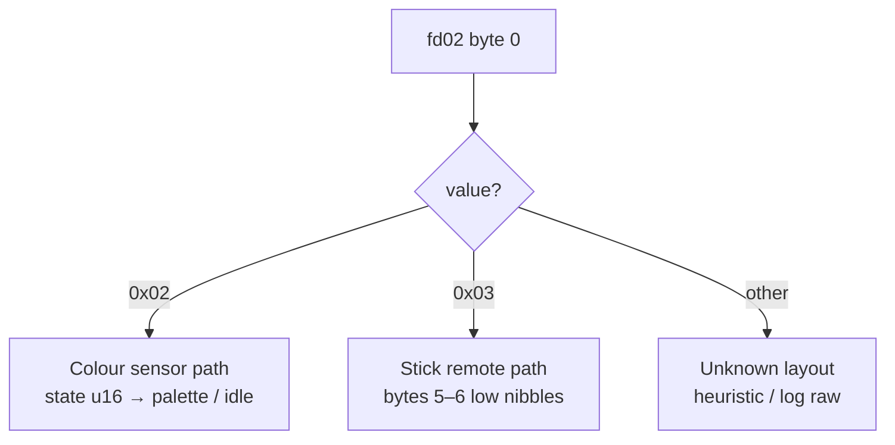

# LEGO CS&AI Coral — BLE `fd02` advertisements & NFC Connection Cards

**Primary content:** Bluetooth LE **Service Data** under `0xFD02` (layout, sticks, sensor colors, tooling behavior).

**Connected GATT** for the same `fd02` service (**write …0001**, **notify …0002** — RPC movement, hub LED, sound) is in [CORAL_BLE_CONNECTED_PROTOCOL.md](CORAL_BLE_CONNECTED_PROTOCOL.md).

**Appendix (end of doc):** **NFC Connection Card** chips, printed IDs vs payload, hypothetical `L3GO` layout, dump checklist — RoboVibe **does not** read NFC; that material is classroom / tooling notes only.

---

## Diagrams

### Two BLE “layers” for the same service UUID

The `fd02` UUID appears in **advertising** (12-byte service data) and as a **connected GATT primary service**. They are different channels: scan vs link.

### 12-byte `fd02` payload (indices 0–11)

Bit indices **0–95** = **12 bytes** on the wire as Service Data for key `fd02`:

Endianness and field semantics match the **Byte layout** table below.

### Classroom / handset phases (operator mental model)

### Byte 0 → decoder branches

---

## RoboVibe — where `fd02` advertisements appear

The browser **cannot emit** arbitrary `fd02` advertisements; RoboVibe **decodes** incoming adverts when Chromium-style **advertisement watching** is available after you grant BLE device access.

**Chrome / Chromium:** On many versions you must enable **Experimental Web Platform features** so advertisement APIs (e.g. `**watchAdvertisements()`**) are available: open [chrome://flags/#enable-experimental-web-platform-features](chrome://flags/#enable-experimental-web-platform-features), set the flag to **Enabled**, then **relaunch** the browser.

**App URL:** [https://robovibe.afarago.hu](https://robovibe.afarago.hu)

| Feature                                    | Path                                        | What you get                                                                                                                                                                                                                                       |
| ------------------------------------------ | ------------------------------------------- | -------------------------------------------------------------------------------------------------------------------------------------------------------------------------------------------------------------------------------------------------- |
| **Coral / LEGO advert lab** (experimental) | [/coral](https://robovibe.afarago.hu/coral) | Scan / log BLE advertisements; filters include `fd02`; human-readable stick and colour summaries follow this document. Optional LWP-related decode for comparison.                                                                                 |
| **AI / ML + Coral GATT**                   | [/ai](https://robovibe.afarago.hu/ai)       | After **connect**, Send-to-Hub uses the **connected** protocol in [CORAL_BLE_CONNECTED_PROTOCOL.md](CORAL_BLE_CONNECTED_PROTOCOL.md), not the 12-byte advert stream. Use [/coral](https://robovibe.afarago.hu/coral) to inspect adverts alongside. |

---

## BLE `fd02` — role of this payload

- **Advertisement layer only** — useful for **scanning**, **identification**, and **coarse state** (sticks or color) without a GATT connection.
- **Not** the same as high‑rate **Powered Up / LWP** input: button **Up / Down / Release** on the connected path uses GATT service `1623`, notify characteristic `1624`, and **5-byte Port Value Single** `0x45` frames. Do **not** expect `0x45` framing inside this **12-byte** `fd02` advert blob.

## Hardware workflow — when `fd02` adverts show up (operator notes)

The points below describe **observed handset behaviour** in the classroom / lab — they explain *why a device might show nothing in scans* or *how to tell remotes apart* in Chromium. They are **not** part of the 12-byte wire layout. **Tap-to-group via NFC Connection Cards** is summarized in **[Appendix: NFC connection cards](#appendix-nfc-connection-cards)**.

| Phase                                      | Typical LED                                               | BLE / adverts (field observation)                                                                                                                                                                                                                                                                                                                                                                                           |
| ------------------------------------------ | --------------------------------------------------------- | --------------------------------------------------------------------------------------------------------------------------------------------------------------------------------------------------------------------------------------------------------------------------------------------------------------------------------------------------------------------------------------------------------------------------- |
| **Power on**                               | **White** — **no group mode** yet                         | **0xFD02** service-data advertisements typically **do not run** (or the peripheral is not in the advertise profile this doc cares about yet).                                                                                                                                                                                                                                                                               |
| **Colour card tapped** (“scan connection”) | LED switches to **the team's colour** (see NFC appendix). | Peripheral enters **advertise / group mode** → `FD02`-keyed service data **starts** and matches the layout in this document.                                                                                                                                                                                                                                                                                                |
| **Picking in Chrome**                      | (card colour)                                             | The **Web Bluetooth** chooser often lists **several** similar devices; **which row is your brick** is **not obvious** from the sheet alone. **Move the target device close** to the computer and sort or watch **RSSI** in a scan log to see **which ID gets stronger**.                                                                                                                                                    |
| **Pairing button (optional)**              | (varies by firmware)                                      | **Not required** for normal `fd02` use — only helps when you want a **human-readable Bluetooth name** in the chooser for a moment. Typical pattern: **first press** enters a brief state where adverts may carry a clearer **local name**; **second press** returns to ordinary **advertise / group** mode (with `fd02` as before). You can skip this entirely and rely on **RSSI**, **LED colour**, or other cues instead. |

**Takeaway:** You only get the `fd02` advertisement stream in the **after card / grouped** regime. In the picker, **RSSI proximity** usually suffices; the **pairing-button name cycle is optional**, not mandatory for decoding or grouping.

## Service Data shape

| Field          | Value                                                       |
| -------------- | ----------------------------------------------------------- |
| UUID key       | `0000fd02-…` / `0xfd02`                                     |
| Payload length | **12 bytes** (other lengths are not treated as this format) |

## Byte layout (12 bytes, indices 0–11)

| Offset   | Size | Endian | Typical / meaning                                                                                                       |
| -------- | ---- | ------ | ----------------------------------------------------------------------------------------------------------------------- |
| **0**    | 1    | —      | **Device / layout id** — see [Byte 0 — device kind](#byte-0--device-kind).                                              |
| **1–2**  | 2    | —      | Often `07 85` in field captures (fixed pattern; not used for stick/colour logic here).                                  |
| **3–4**  | 2    | **LE** | **16-bit product ID**. Display: decimal, **zero‑padded to at least 4 digits** (e.g. numeric `781` → string `0781`).     |
| **5–6**  | 2    | **LE** | **State word** — one little-endian 16-bit value; meaning depends on byte 0 (stick pair in two bytes vs colour reading). |
| **7**    | 1    | —      | Often `d4` (fixed pattern in samples).                                                                                  |
| **8–11** | 4    | **LE** | **32-bit rolling counter** seen in traces.                                                                              |

## Byte 0 — device kind

| `byte0` | Kind           | Description                                                                                                               |
| ------- | -------------- | ------------------------------------------------------------------------------------------------------------------------- |
| `0x02`  | Colour sensor  | Bytes **5–6** are **palette / idle** colour encoding (see [Colour sensor — bytes 5–6 LE](#colour-sensor--bytes-5--6-le)). |
| `0x03`  | Stick remote   | **Byte 5** = left stick, **byte 6** = right stick (see [Stick remote — bytes 5 and 6](#stick-remote--bytes-5-and-6)).     |
| *other* | Unknown layout | Sticks are still read as two stick bytes; colour-table rules apply only when byte 0 is `0x02`.                            |

## Stick remote — bytes 5 and 6

Each stick uses the **low nibble** only: `n = b & 0x0f` (high nibble ignored for the scalar).

| Low nibble `n` | Stick value                                                                       |
| -------------- | --------------------------------------------------------------------------------- |
| `0`            | **0** (idle / centre)                                                             |
| `1`–`3`        | `−1` … `−3`                                                                      |
| `4`–`C`        | **Not defined** for stick deflection on hardware (treat as unknown when decoding) |
| `D`–`F`        | `+1` … `+3` via `−(n − 16)` (`0xD` → `+3`, `0xE` → `+2`, `0xF` → `+1`)            |

- **Idle** adverts: typically both nibbles `0` (left/right both centred).

## Lego CS&AI colour palette

Used when `fd02` byte `0` is **colour sensor** (and aligns with Coding Canvas LegoColor-style numbering elsewhere):

| Index  | Name         |
| ------ | ------------ |
| **0**  | ⚫ Black      |
| **1**  | 🩷 Magenta   |
| **2**  | 🟣 Purple    |
| **3**  | 🔵 Blue      |
| **4**  | 🩵 Azure     |
| **5**  | 🟦 Turquoise |
| **6**  | 🟢 Green     |
| **7**  | 🟡 Yellow    |
| **8**  | 🟠 Orange    |
| **9**  | 🔴 Red       |
| **10** | ⚪ White      |

## Colour sensor — bytes 5–6 LE

Interpret as a **little-endian 16-bit integer** at offset 5:

- `0x00FF` (255) — **no colour** / idle (no palette colour).
- `0`–`10` — indices in the **[Lego colour palette](#lego-colour-palette-colour-sensor)** table above.
- **Other values** — outside palette for display purposes.

For colour-sensor adverts, stick positions are not used (treated as neutral).

## Human-readable log lines

Example shapes (wording may vary by tool):

- **Stick:** `fd02 adv · <product code> · L<left> R<right> · ctr=<counter> · u16=0x<hex>`
- **Colour:** `fd02 adv · … · sensor · colour=<name | none | raw> · …`

`<left>` / `<right>` use `0`, `−1`…`−3` (nibbles **1–3**), `+1`…`+3` (nibbles **D–F**), or `?` when the nibble is not in the defined stick set.

## “Idle-only” advertisement filtering (UI)

Some tools hide **repeated quiet-phase packets** when: service data contains **only** `fd02` payloads; each payload decodes; there is **no** manufacturer data; there is **no** LWP `0x45` chunk in service data; and every payload is **idle** (colour: state word `0x00FF`; stick: both sticks **0**). That cuts down slow idle-only spam when “log idle adverts” is off.

## Caveats

- **Extended advertising**: sniffers sometimes show UUIDs under “Ext ADV” headers while this **12‑byte block** still appears as the service data payload.
- **Bytes 1–2 and 7** are treated as contextual constants in captures; they are not branched on for stick/colour logic in the current decoder.
- **New hardware** with a new byte-0 value needs a new row in the device-kind table in software and an update to this document.

---

## Appendix: NFC connection cards

RoboVibe **does not** read NFC tags. The NFC sections below summarise **findings from classroom setups and phone NFC tools** alongside correlations to **fd02** bytes 3–4 (**product ID**). **Page-level details with an ASCII `L3GO` header are a working hypothesis**, not LEGO-official specification — confirm with **“Read memory” hex** across SKUs before treating offsets as authoritative.

### Chip seen on sample cards (**NXP** MIFARE Ultralight EV1)

| Item                    | Typical detail                                                                                       |
| ----------------------- | ---------------------------------------------------------------------------------------------------- |
| Tag class               | NFC Forum **Type 2**                                                                                 |
| **UID**                 | **7 bytes**, factory-fixed (*example*, Yellow **#0781**: `04 A1 CA 6A DB 1F 90` — yours will differ) |
| Memory                  | Often **80 bytes** (**20 pages × 4 bytes**)                                                          |
| Larger user/read window | Frequently **≈48 bytes** of application area — verify on **your** datasheet / reader                 |

Ultralight EV1 supports **password / PACK** configuration in upper pages even when unlocked.

### NFC memory map (classroom / Connection Card — **verify on your dumps**)

Some readers show **page index** in hex (e.g. `0x05` = **page 5**). One **page** is **four bytes**: **byte 0 … byte 3** of that page.

| Pages       | Byte 0 | Byte 1     | Byte 2  | Byte 3  | Content description                                                                            |
| ----------- | ------ | ---------- | ------- | ------- | ---------------------------------------------------------------------------------------------- |
| **0 – 1**   | `04`   | `A1`       | `CA`    | …       | **UID:** unique serial number from the chip manufacturer (example start only — yours differs). |
| **2 – 3**   | —      | —          | —       | —       | **Internal:** static lock bits and NDEF capability container (exact layout varies).            |
| **4**       | `L`    | `3`        | `G`     | `O`     | **Magic constant:** ASCII `L3GO` validates a LEGO Connection Card record.                      |
| **5**       | `00`   | `07` color | `03` id | `0D` id | **NFC colour + ID:** team colour coding **and** printed ID.                                    |
| **7 – 15**  | `00`   | `00`       | `00`    | `00`    | **Padding:** often empty user space; confirm per dump and card family.                         |
| **16 – 19** | —      | —          | —       | —       | **Config:** password / PACK and EV1 configuration on Ultralight-class parts.                   |

